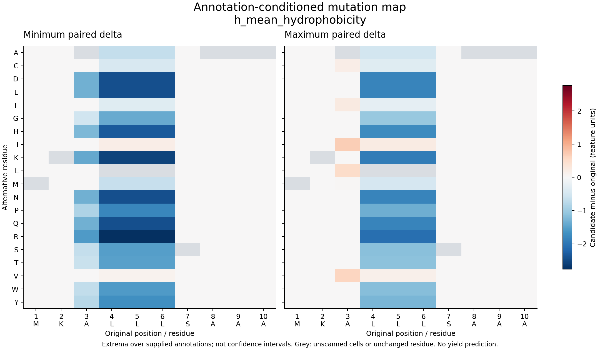

# signal-peptide-features

[日本語](README.ja.md) · [Methods & descriptor dictionary](docs/methods.md)

**Explore one signal peptide in its precursor context, with transparent evidence.**

Version 0.3 adds a local React/TypeScript workspace: linked residue profiles, cleavage
zoom including +1, exploratory N/H/C annotations, a physiological-context × property
matrix, per-metric provenance, structure annotation import and JSON/CSV/HTML/SVG export.
PDF export uses your browser's print dialog. Comparison is in Advanced; legacy mutation
and sensitivity APIs remain available.

```bash
# From the repository directory
pip install -e '.[gui]'
sp-features gui
# Open http://127.0.0.1:8765
```

Unlike general peptide descriptors in [peptides.py](https://peptides.readthedocs.io/),
this project specializes in SP regions and the cleavage junction. Missing annotations
are automatically filled by TSignal **after model setup**. Without setup, they remain
unknown. Sequence properties do not predict secretion yield or cleavage efficiency.
See [GUI and TSignal setup](docs/explorer.md) for coordinates, import formats and limits.


A NumPy-only Python library for interpretable sequence descriptors, paired mutation
maps, annotation sensitivity, composition-preserving order controls, and descriptor
double-mutant cycles. You supply the SP sequences and region annotations. Every CLI
result retains the sequence, coordinates and source.

These calculations describe sequences. Secretion yield, the best SP,
and biological epistasis are not predicted. The optional TSignal adapter supplies
predicted SP presence, type and cleavage annotations. No OrthoSignal code, datasets, labels,
weights or experimental benchmarks are included.

## A hand-checkable ambiguity

In `MKALLLSAAA`, position 3 is in H under boundaries `(2,6)` and in N under `(3,6)`.
For the same A3L substitution:

| Descriptor change | `(2,6)` | `(3,6)` |
|---|---:|---:|
| H mean Kyte–Doolittle hydropathy | +0.5 | 0 |
| Complete-SP mean hydropathy | +0.2 | +0.2 |

Changes are computed **within each annotation before pooling extrema**. This exposes
which explanations depend on where a boundary is placed. The example is synthetic
arithmetic, not a measured secretion experiment.



The plot shows the synthetic case above, not secretion measurements.

## Install from source

Python 3.12 or newer:

```bash
git clone https://github.com/yktsnd/signal-peptide-features.git
cd signal-peptide-features
python -m pip install -e .
```

No PyPI release has been verified. Use the clone or a wheel from a pinned commit.
The core dependency is NumPy; embedding helpers accept precomputed arrays. All
calculations run locally without an API key, model download or GPU.

## FASTA to research tables

```bash
# Legacy fractional regions, explicitly marked as heuristic
sp-features examples/candidates.fasta -o features.csv

# Explicit annotations: one row per sequence and annotation
sp-features examples/candidates.fasta --regions examples/regions.csv -o annotated.csv

# All single substitutions, paired across annotation alternatives
sp-features examples/candidates.fasta --regions examples/regions.csv --mutation-scan -o mutations.csv

# Per-residue scale values and N/H/C membership
sp-features examples/candidates.fasta --regions examples/regions.csv --residue-profiles -o profiles.csv

# Composition-preserving permutations with an explicit sample count and seed
sp-features examples/candidates.fasta --regions examples/regions.csv --order-controls 8 --seed 17 -o controls.csv

# Selected double-mutant cycles: f(AB)-f(A)-f(B)+f(WT)
sp-features examples/candidates.fasta --regions examples/regions.csv --interaction-pairs examples/pairs.csv -o interactions.csv
```

Eight permutations are a software example, not a recommended research sample size.
Analysis modes require explicit annotations and the interpretable preset.
`python -m signal_peptide_features` runs the same CLI. `-` selects stdin/stdout.

Region CSV columns: `sequence_id,annotation_id,n_end,h_end,source`. FASTA IDs must be
unique and match region and pair CSVs exactly. Coordinates are **zero-based,
end-exclusive**: N `[0,n_end)`, H `[n_end,h_end)`, C `[h_end,length)`.
Mutation positions are **one-based**. Example annotations are illustrative, not ground truth.

CSV output includes normalized sequences, sequence/implementation SHA-256,
package/Python/NumPy versions, boundaries and annotation sources. Mutation maps also
retain the annotation set and IDs attaining each delta extreme. Late input failure
preserves an existing output and emits no partial stdout CSV; successful output
replaces an existing destination.

## Python research toolbox

| Research question | Function |
|---|---|
| How much do descriptors vary with boundaries? | `boundary_sensitivity`: min/max/span over supplied annotations |
| Which substitutions change which descriptors? | `mutation_effects`: paired deltas, extrema and direction by annotation |
| Where do scale values originate? | `residue_profiles`: per-residue values and region membership |
| Does composition or order explain the descriptor? | `composition_controls`: seeded composition-preserving permutations |
| Do substitutions combine additively for the descriptor? | `interaction_effects`: caller-selected double-mutant cycles |

```python
from signal_peptide_features import RegionAnnotation, boundary_sensitivity, mutation_effects

annotations = [
    RegionAnnotation("scenario_a", 2, 6, "synthetic arithmetic example"),
    RegionAnnotation("scenario_b", 3, 6, "synthetic boundary alternative"),
]
print(boundary_sensitivity("MKALLLSAAA", annotations)["h_mean_hydrophobicity"])
# min=3.3, max=3.8, span approximately 0.5

for effect in mutation_effects("MKALLLSAAA", annotations, positions=[3], alternatives="L"):
    if effect["feature"] == "h_mean_hydrophobicity":
        print(effect["delta_min"], effect["delta_max"], effect["direction"])
# 0.0 approximately 0.5 annotation_dependent
```

Existing `basic_sp_features(sequence)` and `interpretable_sp_features(sequence)` retain
their default numerical behavior. Supply `boundaries=(n_end,h_end)` for explicit regions.
[Methods](docs/methods.md) documents the legacy C-polarity difference, every descriptor,
units, redundant columns, sources and verification status.

## Reproduce the worked example

```bash
python examples/research_walkthrough.py --output-dir research-output
```

Optional exportable figure (PNG, SVG or PDF):

```bash
python -m pip install -e ".[plots]"
python examples/plot_mutation_map.py research-output/mutations.csv --feature h_mean_hydrophobicity --output research-output/mutation-map.svg
```

The walkthrough produces six tables and a provenance manifest for a synthetic arithmetic case: descriptors, boundary sensitivity,
mutations, profiles, permutations and double-mutant effects. Read the
[research questions](docs/research-questions.md) before interpreting them.

## Verification and publication use

```bash
python -m pip install -e ".[dev]" build
python -m ruff check .
python -m pytest
python -m build
```

Tests cover independently extracted AAindex coefficients, analytic mutation and
interaction cases, composition invariance, deterministic controls and strict input
handling. CI builds and exercises an installed wheel on Python 3.12 and 3.13.
See [validation scope](docs/validation.md).

For a publication, cite the pinned repository commit/version and the scale papers in
[Methods](docs/methods.md). Numerical tests verify software behavior; experimental
secretion benchmarks and external predictive validation remain open.

## License

Original code is MIT licensed. Source-derived scales retain attribution. Their
redistribution treatment, and that of the small independent AAindex fixture, needs
human review before public package release. No external weights, experimental datasets
or copied software are included.
